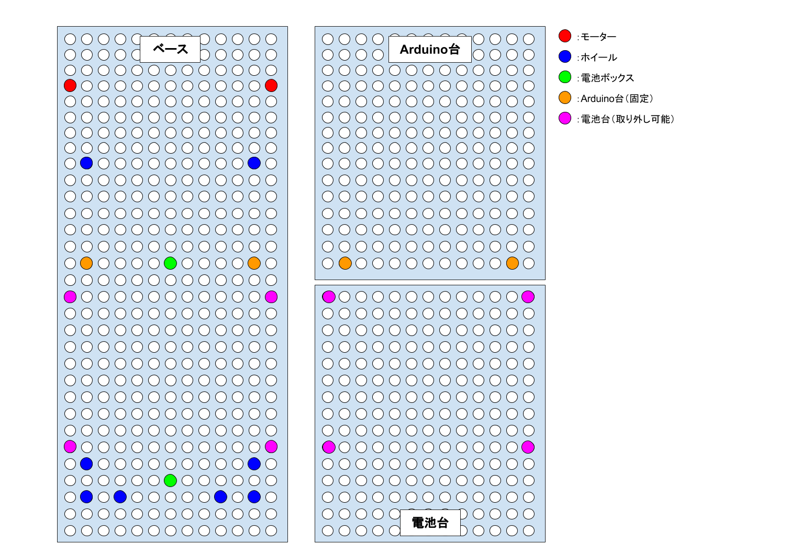
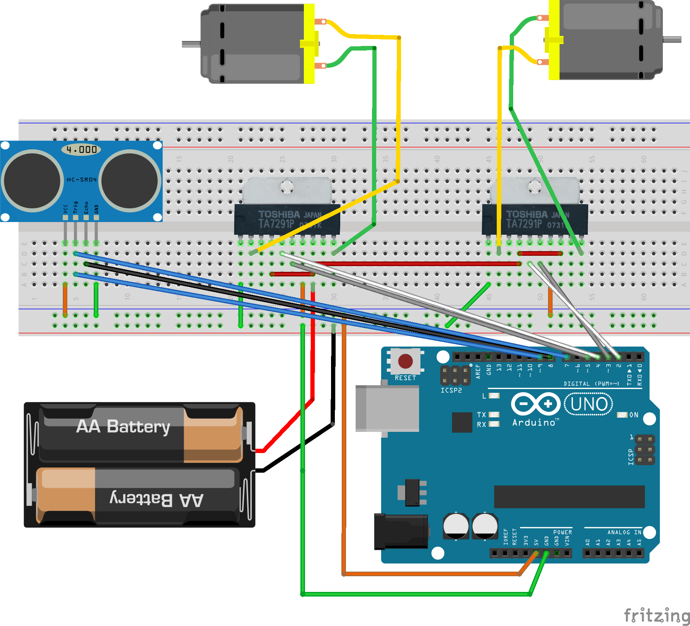

# TamiyaHackTank
タミヤが販売しているタンクキットを使って、Arduinoでモーター制御できるようにしたタンクの作り方やArduinoのサンプルコードを紹介しています。

## レポジトリの中身
- SampleCode：ArduinoとBlocklyDuinoのサンプルコードが入っています
- Circuit：モータードライバとArduinoの接続に関する回路データが入っています
- Image：TamiyaHackTankの各種画像が入っています

## 作り方

1. [部品リスト](https://docs.google.com/spreadsheets/d/1GFMyF7QKVoaPNvtzkHuXjzPc7Tc-55D2XxNh2L3xb0M/edit?usp=sharing)を参考に、必要な部品を揃えます。
2. 商品説明書を参考に、ダブルギアボックスを作成します。
3. ユニバーサルプレートLをニッパでカットします。
4. ダブルギアボックスとホイール、電池ボックスなどをプレートに固定します。
5. モーターにワイヤーをハンダします。
5. Arduinoの設置台を固定し、ワイヤーをターミナルブロックに接続します。
6. 電池台を作成し、載せます。
7. コードをArduinoに書き込み、電池などを入れると動きます。

## 必要な部品

部品の一覧は、[部品リスト](https://docs.google.com/spreadsheets/d/1GFMyF7QKVoaPNvtzkHuXjzPc7Tc-55D2XxNh2L3xb0M/edit?usp=sharing)にまとめています。

以下、補足です。

### ベース
戦車を上下させるだけなら、通常の [タミヤ 楽しい工作シリーズ No.108 タンク工作基本セット ](http://amzn.to/2cnUZjh) で事足りますが、ロボットプログラミングを楽しむためには、ダブルギアにして左右に動かせるようにする必要があります。

また、ダブルギアの採用に伴い、横幅を確保できるユニバーサルプレートを加工しています。

### モーターシールド
Arduinoでモーターコントロールさせるためには、モータードライバーなどの部品が必要になります。

巷で取り扱っているモーターシールドはいずれも5V以上の電源を要しており、戦車ロボにそれほどの電池をのせることが出来ませんでした。

できれば、コンパクトに単三２本（3V程度）で駆動させたかったため、悩んだ挙句、下記のICをハンダ付けして自分でモーターシールドを作成しました。

ぜひ、この機会にハンダしてみてください。

### Arduinoの固定
資料では、ユニバーサルプレートLで作成すると書いてますが、写真内では、[Arduino Holder Type Uno](http://akizukidenshi.com/catalog/g/gP-09397/)を使っています。

もし、Arduinoを頻繁に取り外す場合には、Arduino Holderを使うと便利です。

### 距離センサー
もし、距離センサーを付けたかったら、[超音波距離センサー　ＨＣ－ＳＲ０４](http://akizukidenshi.com/catalog/g/gM-11009/)が安いので、おすすめです。

あと、モーターシールドへの設置には、ピンソケットを活用するとセンサーを着脱できるので、便利です。

### Arduino用電源
Arduinoは、モバイルバッテリーなどで電源を供給すればOKです。

もし、コンパクトな電源をお探しなら、9Vと[２．１ｍｍＤＣプラグ付バッテリースナップ（縦型）](http://akizukidenshi.com/catalog/g/gP-07356/)の組み合わせがおすすめです。

### Arduino Uno
そもそも、Arduinoがないとモーター制御はできません。

ちなみに、スイッチサイエンスさんのArduino Unoは永久保証が付いているので、壊しても交換してもらえて、おすすめです。

## 工具
作成に必要な工具は、下記のようなものです。

- ドライバ
- ニッパ
- ハンダ小手
- ハンダ

## ユニバーサルプレートの加工図面
下記の図面とこちらの[写真](https://goo.gl/photos/RhmUzpuK7QpetXwV8)を参考に、ユニバーサルプレートを加工、部品を取り付けてください。

## モーターシールドの配線
[配線図](./Circuit/tamiya-robo.fzz)を参考にしてください。

なお、図面データは、回路作成ソフトの [fritzing](http://fritzing.org/projects/) で作成しています。

### Arduinoのピン配列

- D2 : TA7291P Motor1 IN1
- D3 : TA7291P Motor1 IN2
- D4 : TA7291P Motor2 IN1
- D5 : TA7291P MOTOR3 IN2
- D7 : HC-SR04 Trigger
- D8 : HC-SR04 Echo
- D9 : HC-SR04 Trigger
 
## サンプルコードの内容

### HackTank-basic
HackTankの基本的な動きを関数化しています。

- forward : 前に進みます
- back    : 後ろに進みます
- right   : その場で右に回転します
- left    : その場で左に回転します
- stop    : 少し停止します
- freeze  : 完全に動作が止まります

なお、freeze関数は無限Loopが入っているので、その後にどんなブロックを入れても動作しません。注意してください。

### HackTank-goal
事前に設定したコースを、HackTankをうまく制御してゴールするためのサンプルコードです。

### HackTank-auto
HackTankに距離センサーをつけて、自動的に障害物を避けるサンプルコードです。

## ライセンス
この文書は [クリエイティブ・コモンズ 表示 – 継承 4.0 国際 ライセンス](https://creativecommons.org/licenses/by-sa/4.0/)の下に提供されています。